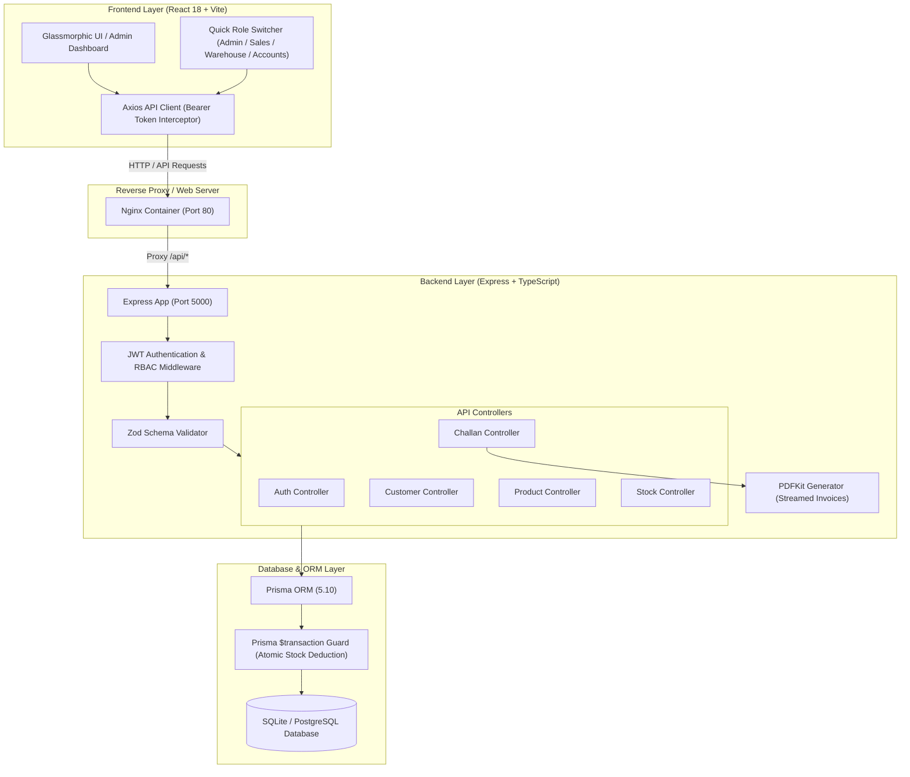
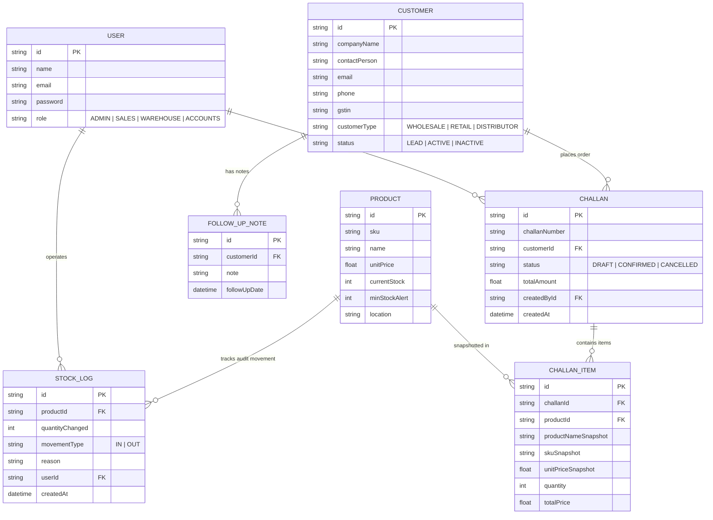

# 🏢 Mini ERP + CRM Operations Portal

A modern, production-grade **Mini ERP + CRM Operations Portal** built for wholesale and distribution businesses. The application streamlines Customer Relationship Management (CRM), Product Catalog & Stock Tracking, Immutable Stock Audit Logging, Sales Challan Creation with Product Pricing Snapshots, Automatic Stock Deductions, Role-Based Access Control (RBAC), and Server-Side PDF Invoice Generation.

---

## 🌟 Key Features

1. **JWT Authentication & Role-Based Access Control (RBAC)**:
   - 4 Granular Roles: `ADMIN`, `SALES`, `WAREHOUSE`, `ACCOUNTS`.
   - **Quick Role Switcher**: Top header UI bar to switch between active role sessions instantly for evaluation.
2. **Customer CRM Module**:
   - Manage Wholesale, Retail, and Distributor clients.
   - Lead / Active / Inactive pipeline tracking.
   - Schedule follow-up dates and log timeline interaction notes.
3. **Product & Inventory Catalog**:
   - SKU tracking, storage locations, unit pricing, current stock.
   - **Low Stock Threshold Alerting** (`currentStock <= minStockAlert`).
   - Manual Stock Adjustments (`IN` / `OUT`) with mandatory reason logging.
4. **Immutable Stock Audit Logs**:
   - Complete historical tracking of product movement, quantity changed, movement type (`IN`/`OUT`), trigger reason, and operator user ID.
5. **Sales Challans & Business Logic**:
   - Auto-generated challan numbers (`CHLN-YYYYMMDD-XXXX`).
   - **Pricing Snapshots**: Retains product name, SKU, and unit price at the time of challan creation so future catalog edits never corrupt historical challan data.
   - **Automatic Stock Deduction**: Confirming a challan validates stock availability, deducts inventory, and records `OUT` movement logs inside an atomic Prisma transaction.
   - **Stock Protection**: Throws errors if stock is insufficient. **Stock levels can NEVER go negative**.
6. **Official PDF Invoice Export**:
   - On-the-fly server-side PDF generation using `PDFKit` with itemized pricing, customer tax details (GSTIN), and signature blocks.

---

## 🛠️ Tech Stack & Dependencies

- **Backend**: Node.js (v18+/v20+), Express.js, TypeScript 5.3+, Prisma ORM, SQLite (`dev.db` for local zero-config setup) / PostgreSQL (production), JWT (`jsonwebtoken`), Zod, PDFKit.
- **Frontend**: React 18, Vite, TypeScript, Lucide Icons, Custom Glassmorphic Dark Admin UI.
- **DevOps & Tools**: Docker, Docker Compose, Postman API Collection.

---

## 📐 System Architecture & ER Diagrams

### 1. System Architecture & Data Flow



### 2. Database Entity Relationship Diagram (ERD)



---

## 🏗️ 1. How the Server Was Set Up

The backend server is architected as a modular, RESTful API web service built with Node.js, Express, and TypeScript.

### Project Architecture & Design Patterns
- **Entry Point ([backend/src/server.ts](file:///c:/Users/admin/.gemini/antigravity-ide/scratch/mini-erp-crm/backend/src/server.ts))**: Initializes the Express app on the configured port, handles process-level uncaught exceptions and unhandled promise rejections.
- **Application Assembly ([backend/src/app.ts](file:///c:/Users/admin/.gemini/antigravity-ide/scratch/mini-erp-crm/backend/src/app.ts))**: Configures core global middlewares:
  - `cors()` for cross-origin request handling.
  - `express.json()` for JSON payload parsing.
  - Health check endpoint at `GET /health`.
  - API Routes mounted under `/api/*` (`/auth`, `/customers`, `/products`, `/stock`, `/challans`).
  - Centralized global error handling middleware (`errorHandler`).
- **Modular Directory Structure**:
  - `backend/src/config/`: Environment configuration parser & fallback defaults ([index.ts](file:///c:/Users/admin/.gemini/antigravity-ide/scratch/mini-erp-crm/backend/src/config/index.ts)).
  - `backend/src/controllers/`: Request processing and HTTP response handlers.
  - `backend/src/middleware/`: Authentication (`authenticate`), Role Authorization (`authorize`), and Error handling (`errorHandler`).
  - `backend/src/routes/`: Express router definitions.
  - `backend/src/services/`: Core logic services (e.g., PDF generation engine).
  - `backend/src/utils/`: Shared helper functions & Zod schema validation rules.
  - `backend/prisma/`: Prisma ORM schema (`schema.prisma`) and seed dataset script (`seed.ts`).

---

## 🔐 2. How Environment Variables Are Managed

Environment variable management decouples sensitive configuration keys from the codebase while supporting seamless transitions across local development, staging, and production environments.

### Backend Environment Setup
- The backend utilizes the `dotenv` package loaded inside [backend/src/config/index.ts](file:///c:/Users/admin/.gemini/antigravity-ide/scratch/mini-erp-crm/backend/src/config/index.ts).
- Variables are stored in a `.env` file located in the root of the `backend/` directory ([backend/.env](file:///c:/Users/admin/.gemini/antigravity-ide/scratch/mini-erp-crm/backend/.env)).

#### Key Environment Variables

| Variable Name | Description | Default (Local Dev) | Environment |
|---|---|---|---|
| `PORT` | Port on which Express backend server listens | `5000` | All |
| `DATABASE_URL` | Database connection URL for Prisma ORM | `"file:./dev.db"` | Dev / Production |
| `JWT_SECRET` | Secret key used to sign & verify JWT tokens | `"mini_erp_crm_super_secret_jwt_key_2026"` | All |
| `NODE_ENV` | Application environment mode (`development`/`production`) | `"development"` | All |

### Frontend Proxy Configuration
- In development, Vite proxys requests starting with `/api` to `http://localhost:5000` via [frontend/vite.config.ts](file:///c:/Users/admin/.gemini/antigravity-ide/scratch/mini-erp-crm/frontend/vite.config.ts), avoiding hardcoded URLs or CORS issues.
- In production (Docker/Nginx), `/api` requests are reverse-proxied directly to the backend container.

---

## 💻 3. How to Run the Project Locally

### Prerequisites
- **Node.js**: v18.0.0 or higher (v20 recommended)
- **npm**: v9.0.0 or higher

---

### Step-by-Step Local Execution

#### 1. Setup & Run Backend API
```bash
# Navigate to the backend directory
cd backend

# Install dependencies
npm install

# Apply database migrations / schema push (creates dev.db SQLite database)
npx prisma db push

# Seed initial test dataset (Users, Customers, Products, Stock Logs, Seed Challans)
npx prisma db seed

# Start the backend development server (http://localhost:5000)
npm run dev
```

#### 2. Setup & Run Frontend Client
```bash
# In a new terminal window, navigate to the frontend directory
cd frontend

# Install dependencies
npm install

# Start Vite development server (http://localhost:3000)
npm run dev
```

Open `http://localhost:3000` in your web browser.

---

### 🔑 Pre-Seeded Test Credentials for Role Evaluation

| Role | Email | Password | Primary Permissions |
|---|---|---|---|
| **Admin** | `admin@minierp.com` | `password123` | Full unrestricted system access |
| **Sales** | `sales@minierp.com` | `password123` | Customer CRM, Follow-ups, Sales Challan Creation |
| **Warehouse** | `warehouse@minierp.com` | `password123` | Product catalog, Manual Stock Adjustments, Audit Logs |
| **Accounts** | `accounts@minierp.com` | `password123` | Customer GSTINs, Challan review, PDF Export |

*Note: Use the **Quick Role Switcher** bar at the top of the UI header to switch roles with a single click.*

---

## 🚀 4. How to Deploy the Project

### Method A: Docker Compose Deployment (Recommended Containerized Setup)

The repository provides multi-stage `Dockerfile`s for both backend and frontend, managed by a root [docker-compose.yml](file:///c:/Users/admin/.gemini/antigravity-ide/scratch/mini-erp-crm/docker-compose.yml).

#### Run Containerized Stack
From the project root directory (`mini-erp-crm/`):

```bash
# Build and start all services in detached mode
docker-compose up --build -d
```

#### Service URLs
- **Frontend App**: `http://localhost` (Port 80 via Nginx)
- **Backend API**: `http://localhost:5000` (Port 5000 via Node.js container)

To stop services:
```bash
docker-compose down
```

---

### Method B: Cloud Platform Deployment (e.g., Render, Railway, AWS, Vercel)

#### Backend Deployment
1. Set Environment Variables: `PORT`, `NODE_ENV=production`, `JWT_SECRET`, `DATABASE_URL`.
2. Database Provisioning: For managed PostgreSQL (AWS RDS / Supabase / Neon / Railway), update `provider = "postgresql"` in `backend/prisma/schema.prisma` and pass your cloud PostgreSQL URL in `DATABASE_URL`.
3. Build Command: `npm install && npx prisma db push && npm run build`
4. Start Command: `npm start` (`node dist/server.js`)

#### Frontend Deployment
1. Build static production assets: `cd frontend && npm run build`.
2. Upload `frontend/dist/` build directory to Vercel, Netlify, Cloudflare Pages, or AWS S3.
3. Configure path rewrites routing `/api/*` to your deployed backend URL.

---

## 💡 5. Key Assumptions Made

1. **Database Engine Choice**: SQLite was chosen for zero-dependency local development and evaluation without requiring external database installation. Prisma ORM abstraction makes migrating to PostgreSQL straightforward.
2. **Stateless JWT Authentication**: Standard Bearer token header authentication (`Authorization: Bearer <token>`) is used across API routes. Inline PDF downloads (`/api/challans/:id/pdf`) support token passing via query parameter (`?token=...`) for direct browser downloads.
3. **Transactional Inventory Protection & Stock Rules**:
   - Stock quantities cannot go negative (`currentStock >= 0`).
   - Sales Challan confirmation and stock deduction are wrapped inside a Prisma `$transaction()`, ensuring stock level decrement and audit log creation occur atomically.
   - Price snapshots are recorded at the time of Challan creation so subsequent product master price updates do not retroactively alter historical invoices.
4. **In-Memory PDF Generation**: PDF invoices are generated dynamically in-memory using `PDFKit` streaming. This avoids server disk writes or third-party cloud storage bucket dependencies for simpler deployment.
5. **Tax Calculations & GST**: Tax calculation defaults to standard rates with GSTIN numbers stored per customer entity, accommodating wholesale vs. retail differentiation.

---

## 📑 Postman API Collection

A pre-configured Postman Collection is included at `mini_erp_crm_postman_collection.json`.

### Import & Test:
1. Open Postman → Click **Import** → Select `mini_erp_crm_postman_collection.json`.
2. Execute `1. Authentication -> Login (Admin)` to obtain your JWT token.
3. Set the `jwtToken` collection variable with the returned token string.
4. Test endpoints across Auth, Customers, Products, Stock Adjustments, Sales Challans, and PDF Export.
